<picture>
  <source media="(prefers-color-scheme: dark)" srcset="https://raw.githubusercontent.com/renatograsso10/renatograsso10/output/snake-dark.svg" />
  <source media="(prefers-color-scheme: light)" srcset="https://raw.githubusercontent.com/renatograsso10/renatograsso10/output/snake.svg" />
  
</picture>

<code>// ./session.exit — keep your tests green and your prod quiet.</code>

