<div align="center">
  
</div>

<div align="center">

[](https://www.linkedin.com/in/renato-grasso-qa/)
[](https://github.com/renatograsso10)
[](mailto:renatograsso95@gmail.com)
[](https://github.com/renatograsso10)

</div>

```bash
guest@grasso:~$ whoami --verbose
```

```yaml
name:      Renato Grasso
role:      QA Engineer @Keeggo
location:  São Vicente / SP — Brazil
timezone:  UTC-3
status:    breaking things on purpose, then fixing them
mission:   ship software that does not page anyone at 3am
```

```bash
guest@grasso:~$ cat stack.txt
```

<table>
<tr>
<td valign="top" width="25%">

**`automation`**
```
playwright
cypress
selenium
appium
```

</td>
<td valign="top" width="25%">

**`api / perf`**
```
restassured
karate dsl
postman
k6
```

</td>
<td valign="top" width="25%">

**`languages`**
```
typescript
javascript
java
python
ruby
c
```

</td>
<td valign="top" width="25%">

**`delivery`**
```
docker
jenkins
azure devops
gitlab ci
gh actions
```

</td>
</tr>
</table>

<div align="center">
  
  
  
  
  
  
  
  
  
  
  
  
  
  
  
</div>

```bash
guest@grasso:~$ ./focus --now
```

```diff
+ test automation that catches regressions before deploy
+ API, mobile and web quality pipelines end-to-end
+ performance budgets and SLO thinking with k6
+ backend labs: APIs, containers, observability
- flaky tests, manual smoke runs, "works on my machine"
```

```bash
guest@grasso:~$ ./telemetry --live
```

<div align="center">
  
  
</div>

<div align="center">
  
</div>

<div align="center">
  
</div>

```bash
guest@grasso:~$ uptime
```

```
loadavg:  building · learning · breaking · shipping
exit 0
```

<div align="center">
  <sub><code>// thanks for stopping by — keep your tests green and your prod quiet.</code></sub>
</div>
